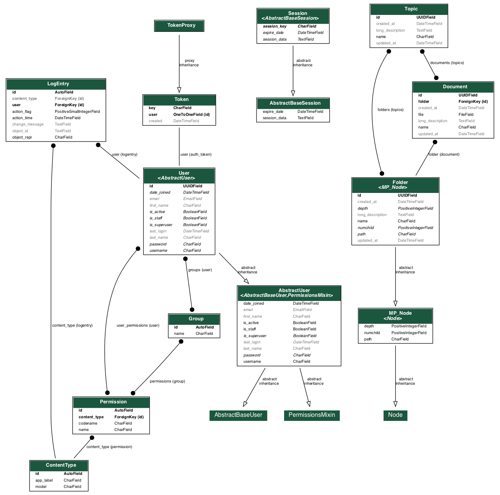

# Spekit Coding Challenge

This repo contains my submission for Spekit's coding challenge.

Live Server: https://livcarman-spekit.herokuapp.com/

* [Getting Started](#getting-started)
* [Deployment](#deployment)
* [Design](#design)
  * [Data Model](#data-model)
  * [Authentication and Authorization](#authentication-and-authorization)
  * [Serving Digital Documents](#serving-digital-documents)

## Getting Started

1. Edit the environment variables in `.env.dev`. In particular, you'll need to provide AWS credentials and S3 bucket details if you want to use the S3 storage backend.
   * If you prefer, you can use Django's default file storage for local development. To do that, set `DEFAULT_FILE_STORAGE` and `STATICFILES_STORAGE` to `django.core.files.storage.FileSystemStorage`.
2. Start the database and Django app with `docker-compose up --build`.
   * The first time you start the Docker environment, you may encounter a race condition where the container tries to run migrations before Postgres is ready to accept connections. The easiest workaround is to restart the containers with `docker-compose down && docker-compose up`
3. Access the app at `http://localhost:8080`

## Deployment

The app is deployed to Heroku's free tier as a Docker container. To release a new build with the Heroku CLI, do:

```bash
heroku container:login
heroku container:push web --app livcarman-spekit
heroku container:release web
```

Where `livcarman-spekit` is the name of the Heroku app.

You will need to enable the Heroku Postgres add-on. You'll also need to make sure that the environment variables in `.env.dev` are available as Heroku keys (with secure production values, of course).

## Design

Given the constraint that the app be built with Django, I focused on using the standard toolkit for Django REST APIs: Django Rest Framework, django-filters, etc. Even so, there were a few interesting design decisions to make.

### Data Model

The app needs to represent **folders** of **documents**, which can be tagged with various **topics** to help organize them. Folders are hierarchical: they have a tree structure, with parents, children, and siblings. Representing trees efficiently in SQL is not trivial, and there are three main approaches:

1. [**Nested Sets**](https://en.wikipedia.org/wiki/Nested_set_model) -- Fast reads, slow writes. This is the strategy the popular `django-mptt` package uses.
2. [**Adjacency List**](https://en.wikipedia.org/wiki/Adjacency_list) -- Fast writes, slow reads. A simple implementation of this idea would be to store a `parent_id` field on each node.
3. [**Materialized Path**](https://docs.mongodb.com/manual/tutorial/model-tree-structures-with-materialized-paths/) -- Fast reads and writes, but can become inconsistent over time. Each node stores the full path from the root to itself as a denormalized `path` attribute.

Most Django apps that deal with tree relationships -- like CMS systems with page hierarchies -- use the materialized path implementation provided by [`django-treebeard`](https://django-treebeard.readthedocs.io/en/latest/index.html). We'll do the same.

In this particular implementation of a materialized path tree, I've made some simplifying assumptions:

1. We don't care about the order of siblings. If two documents are in the same folder, we don't care which document is "left" and which one is "right". This simplified the update logic for folders, since it means we don't need to let users reorder siblings.
2. We don't care if siblings have the same name. In a real application, this would lead to a pretty miserable user experience in the UI, but it simplified the validation logic. 

Adding in all of Django's default models, the complete UML diagram for the app looks like this:



### Serving "Digital Documents"

"Digital documents" could mean many things. In many CMS systems, for example, documents like pages and blog posts are stored in the database, their contents represented with Markdown or a similar markup language. "Digital documents" could also mean files that are stored separately as static assets and referenced by the database.

Since this is a timeboxed coding exercise, I picked the interpretation I thought would be the most fun to build and decided that documents would be _files_ that get stored in S3.

The app uses `django-storages` and `boto3` to upload files to S3 and generate signed S3 URLs. When an API user accesses a document, they are given a signed S3 URL that they can use to download the file from S3.

### Authentication and Authorization

The app is using Django REST Framework's basic authentication, session authentication, and token authentication backends. All endpoints are set to readonly for anonymous users, while authenticated users have full access. In the absence of any specific requirements, this seemed like a sane default.
